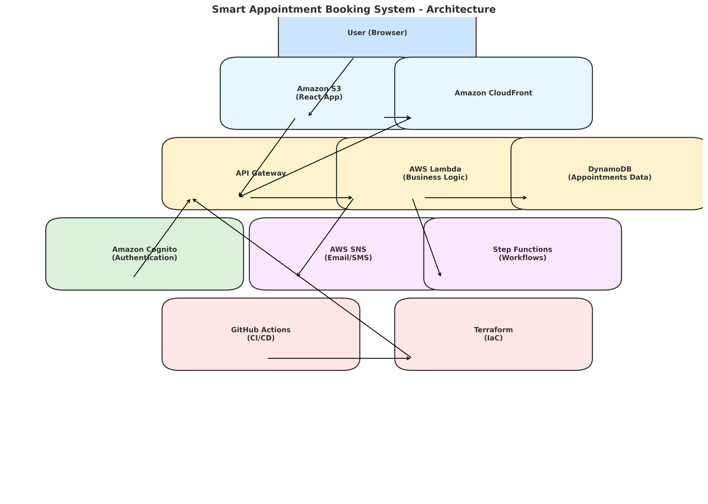

# smart-appointment-system

Cloud-native appointment booking system (React + AWS + Terraform)

# 🗓️ Smart Appointment Booking System

A fully **cloud-native, serverless appointment booking platform** built using AWS services, React.js, and Terraform. This project is designed to demonstrate **real-world architecture skills** for production-scale systems.

> ✅ Built to showcase Solution Architecture — from frontend to infrastructure.

---

## 🚀 Live Features

- ✅ Book / cancel / reschedule appointments
- ✅ Serverless backend (Lambda + API Gateway + DynamoDB)
- ✅ React frontend hosted on S3 + CloudFront
- ✅ Authentication via Cognito (optional)
- ✅ SMS/email reminders using SNS + Step Functions
- ✅ CI/CD pipeline using GitHub Actions
- ✅ Infrastructure as Code with Terraform

---

## 🧱 Architecture Overview

| Layer          | Technology                              |
| -------------- | --------------------------------------- |
| Frontend       | React.js, S3 static hosting, CloudFront |
| Backend        | AWS Lambda, API Gateway, DynamoDB       |
| Notifications  | AWS SNS + Step Functions                |
| Auth           | Amazon Cognito                          |
| Infrastructure | Terraform (IaC), GitHub Actions         |

---

## 🏗️ Folder Structure

```
smart-appointment-system/
│
├── frontend/         # React single-page app
├── backend/          # Node.js Lambda functions
├── infrastructure/   # Terraform scripts
├── ci-cd/            # GitHub Actions workflows
├── docs/             # Architecture diagrams
└── README.md
```

---

## 📸 Architecture Diagram



---

## 📦 How to Deploy

### 1. Deploy Infrastructure (Terraform)

```bash
cd infrastructure
terraform init
terraform apply
```

This creates:

- S3 bucket for frontend
- DynamoDB table for appointments
- IAM roles and Lambda permissions

---

### 2. Deploy Lambda Functions

```bash
cd backend/functions
zip -r bookAppointment.zip .
aws lambda update-function-code \
  --function-name bookAppointment \
  --zip-file fileb://bookAppointment.zip
```

Repeat for each Lambda.

---

### 3. Build and Upload Frontend

```bash
cd frontend
npm install
npm run build
aws s3 sync build/ s3://smart-appointment-frontend
```

---

### 4. Set Up CI/CD

Push your repo to GitHub — CI/CD is auto-triggered on push to `main`.

---

## 🧑‍💻 Author

**Missie Kahsay**  
AWS Certified Solutions Architect  
[GitHub](https://github.com/MissieKahsay) | [LinkedIn](https://linkedin.com/in/missiekahsay)

---

## 🏁 Final Notes

✅ This project demonstrates real-world:

- Multi-tier AWS architecture
- Production deployment readiness
- Infrastructure automation
- Serverless microservices best practices

---
